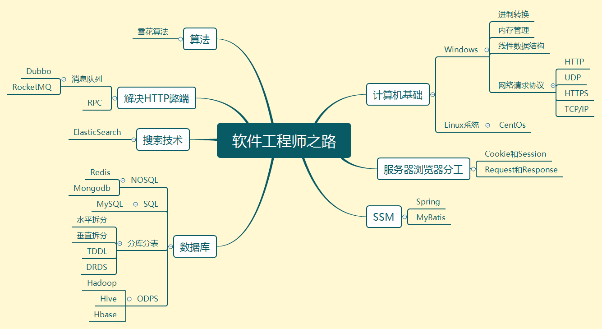

# 学习记录

## 学习导图

## 环境搭建

#### JDK

- JDK：[JDK安装教程](./环境搭建/JavaJDK/JavaJDK安装.md)

#### 开发环境

- IntelliJ Idea：
- eclipse：
- Visual Studio：
- Visual Code：

#### 服务器

- Tomcat：[Tomcat安装](./环境搭建/Tomcat/Tomcat安装.md)

#### 包管理

- maven：[maven下载及镜像配置](./环境搭建/maven下载及安装.md)

#### 数据库

##### 可视化

- Navicat Premium 12：

##### SQL数据库

- mysql：

##### NoSQL数据库

- mongodb：[MongoDB安装](./环境搭建/Mongdb/MongDB安装.md)
- redis:

## 编程开发

### java

- [对象和类](./编程开发/Java/对象和类.md)
- [继承](./编程开发/Java/继承.md)
- [类装载器](./编程开发/Java/类装载器.md)

### spring

- [SpringMVC](./Spring/SpringMVC.md)

### MyBatis

- [jdbc连接数据库](./mybatis/jdbc连接数据库.md)
- [MyBatis](./mybatis/Mybatis.md)
- [MyBatis使用](./mybatis/MyBatis使用.md)
- [MyBatis连接时出现时区问题](./mybatis/MySql连接时出现时区问题.md)

### SpringBoot

- [SpringBoot Web初步](./SpringBoot/SpringBoot的Web项目.md)
- [SpringBoot 缓存](./SpringBoot/SpringBoot缓存.md)

### Thymeleaf

- [Thymeleaf](./SpringBoot/页面模板Thymeleaf.md)

## 技巧

### win10使用技巧

- [优雅的使用Win10](./技巧类/Win10使用/优雅的使用Win10.md)

### 常用软件

### 生活技巧

### 网站收集

## 数学知识

### 数据结构

- [数据结构笔记](./数学类/数据结构/数据结构笔记.md)
- [起泡排序](./数学类/数据结构/起泡排序.md)
- [归并排序](./数学类/数据结构/归并排序.md)
- [二分查找](./数学类/数据结构/二分查找.md)
- [插值查找](./数学类/数据结构/插值查找.md)
- [列表](./数学类/数据结构/列表.md)

## 小问题

- [在禁用右键的情况下查看网页源码](./小问题类/网页禁用右键查看网页源码的方式.md)

