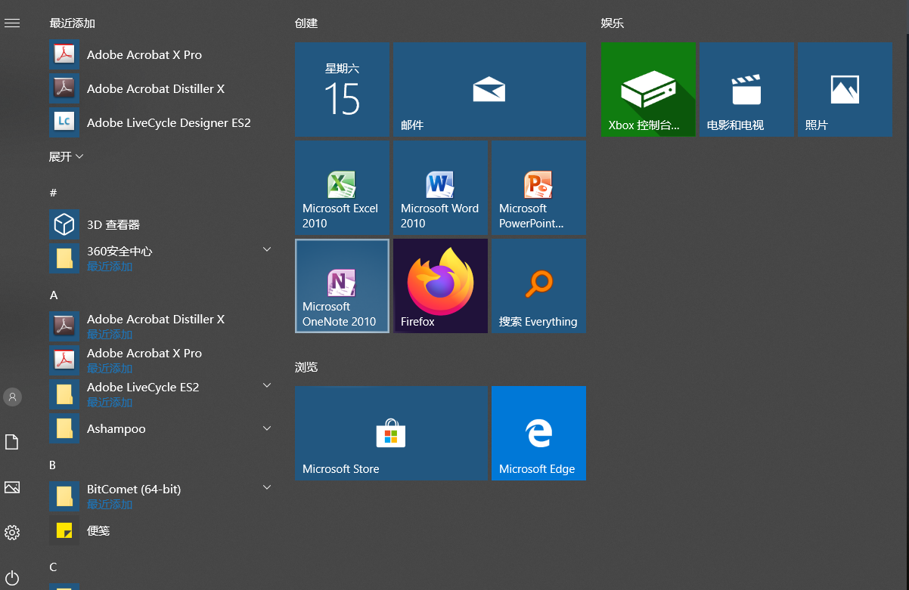
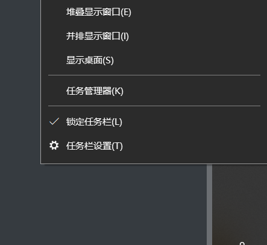
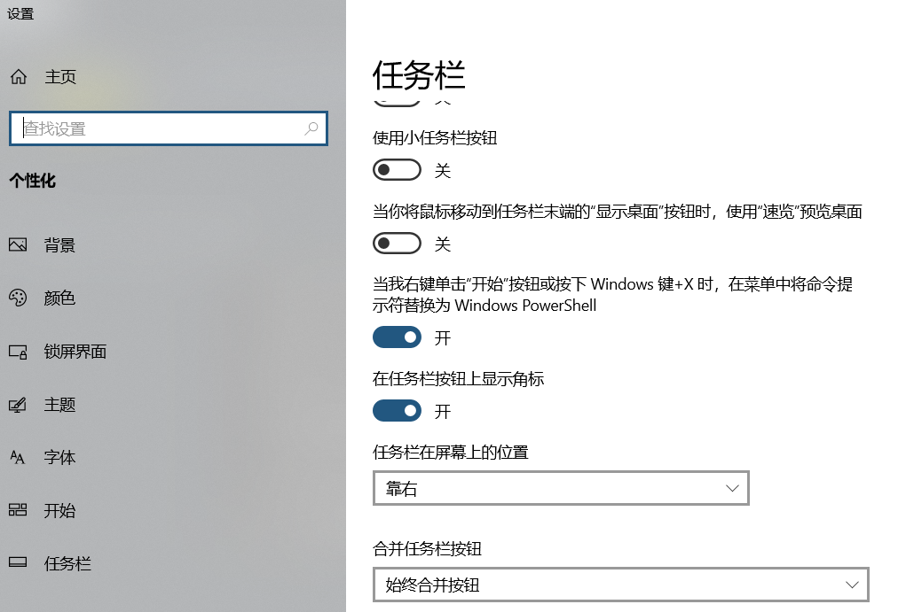
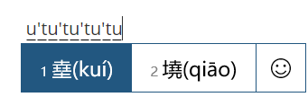

# 优雅的使用Win10

## 目标

- 操作快捷方便
- 界面美观实用
- 隐私防护安全

## Windows快捷键

- Win+D：显示桌面
- Win+E：打开资源管理器
- Win+I：打开设置界面
- ==Win+R==：打开运行窗口
- Win+P：使用投影仪时，打开投影选项
- Win+Q/S：打开Cortans搜索框
- ==Win+W==：打开Windows INK工作区，内有便利贴等功能
- ==Win+数字键==：打开固定在任务栏上的软件
- Ctrl+Alt+Del：打开任务管理器

## Windows开始界面

这里是放置所有APP快捷方式的地方，相较于桌面，你可以**在任何界面按下Windows键呼出开始菜单，从而直接打开应用**，而不必最小化回到桌面上。对于**一些不常用的APP，只要把图标拖到另一个上就会被自动收纳**。同时，相较于桌面的快捷方式，这里的图标更大更易整理。

## 任务栏

主要用来放置**高频应用**，包括浏览器以及个人高频使用的软件等。这样就可以通过**Windows+数字键**，快速打开任务栏上的APP。

## 桌面和任务栏

桌面可以放置临时文件以便操作，但平时就应该将桌面文件整理归类，平时的桌面应该保持整洁，对于16：9（10）这样的矩形屏幕，建议==任务栏右置==而非放在下面，这样可以增加纵向显示面积，充分利用横向空间，使屏幕利用率而对阅读干扰小。

任务栏右置方法：

- 在任务栏上右键点击，选择任务栏设置；

  

- 然后将“任务栏在屏幕上的位置”下拉选择“靠右”；

  

## 文件管理器

快捷键：Windows+E 

可以将常用文件夹设置为快速访问，免去繁琐的操作，当然前提是把文件归类放好。

## 多任务处理

快捷键：==windows+方向键==

切换：==windows+tab==

## 截屏和录屏

截屏：windows+shift+s

录屏：windows+G

## 控制面板

上帝模式是Win10的一项隐藏功能，指将所有设置全部放入一个文件夹里，就像上帝一样，随心所欲进行任何操作。

开启方式：在桌面建立一个文件夹，然后将文件夹命名为`GodMode.{ED7BA470-8E54-465E-825C-99712043E01C}`，回车确认后会发现文件夹变得跟控制面板一样的图标，表示设置成功。

## 自带输入法

### 丰富的表情包

在编辑场景下，使用快捷键`ctrl+shift+B`就能调出Windows输入法自带的特殊符号面板，里面有内置表情包、颜文字和特殊符号。

### 生僻字输入

在不知道某个复杂生僻字的读音时，只要会写，就能打出来。

具体操作：在中文输入法的模式下，先输入一个字母 u ，然后进行组成该汉字的部首，比如：

## 剪切板历史功能记录

Win+V：打开历史记录面板，选择需要的记录；

Ctrl+V：复制到需要的地方；

## 放大镜

Win+"+"：可以对屏幕进行放大；

Win+"-"：对屏幕进行缩小；

## 虚拟键盘

Win+Ctrl+O：打开虚拟键盘

## 高性能电源模式

在win10中最强的电源模式--卓越模式，在管理员模式下运行powershell，然后输入`powercfg -duplicatescheme e9a42b02-d5df-448d-aa00-03f14749eb61`,就能激活卓越模式计划。