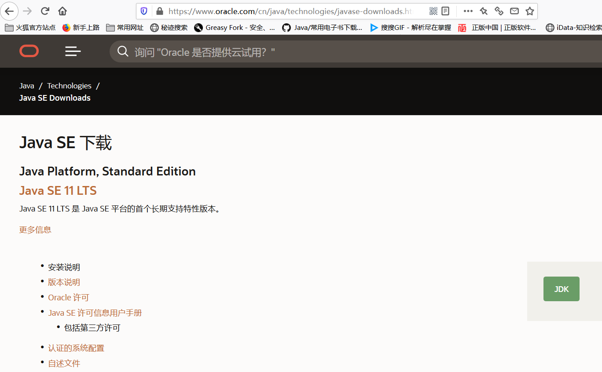
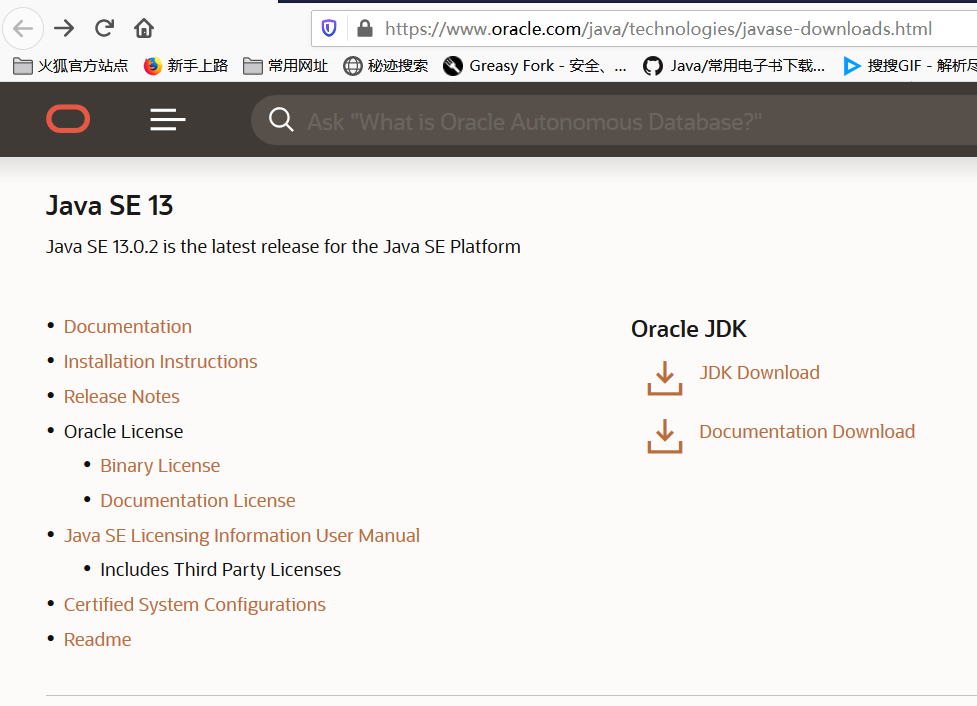
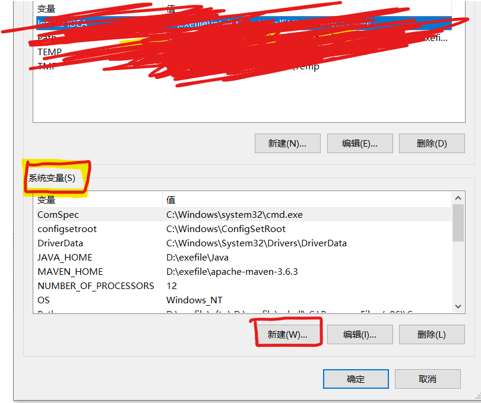

# Java JDK安装

## 一、下载

#### 中文官网

**官方网址**（中文版）：[https://www.oracle.com/cn/java/technologies/javase-downloads.html](https://www.oracle.com/cn/java/technologies/javase-downloads.html)

- 点进去可以看到如下图所示的页面，然后可以选择不同版本的JDK，选好版本后根据操作系统版本以及位数选择合适的安装包进行下载。

- 同样，在该页面也能找到相应的文档进行下载。

#### 英文官网

**官方网址**（英文版）：[https://www.oracle.com/java/technologies/javase-downloads.html](https://www.oracle.com/java/technologies/javase-downloads.html)

## 二、安装

#### 安装步骤

1. 双击下载好的安装包进行安装，可以点击更改，将JDK安装到自己想要的位置，然后持续下一步；
2. 中间弹出安装JRE的安装界面，可以调整下安装位置，下一步即可。
3. 安装完成后进行环境变量的配置。

#### 配置环境变量

1. 右键点击“我的电脑”---->“属性”---->“高级系统设置”

2. 在弹出的对话框中选择“高级”选项卡下的“环境变量”

3. 以下操作均在`系统变量(s)`选项下操作，如下图所示：

   

4. 新建环境变量 JAVA_HOME：

   - “系统变量”下“新建”，在弹出的对话框中进行输入；
   - 在“变量名”后输入`JAVA_HOME`
   - 变量值：JDK安装路径

5. 新建环境变量 classpath：

   - “系统变量”下“新建”，在弹出的对话框中进行输入；
   - 变量名：`classpath`
   - 变量值：`%JAVA_HOME%\libdt.jar;%JAVA_HOME%\libtools.jar`

6. Path新增：

   - 选择Path变量，点击编辑；
   - 在弹出窗口中选择“新建”，输入`%JAVA_HOME%\bin`

## 三、安装验证

在cmd窗口输入：`java -version`，如果能够成功打印版本号信息，证明安装成功。