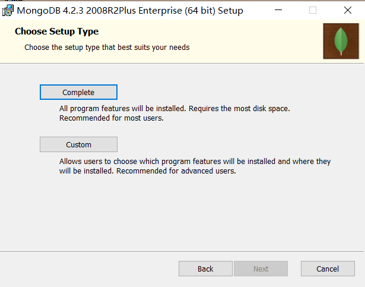
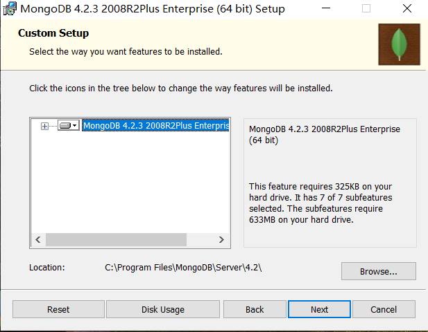
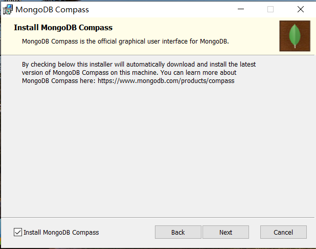
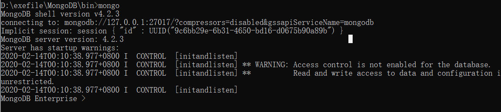

# MongDB安装

## 下载

**官方网址**：[https://www.mongodb.com/download-center/enterprise](https://www.mongodb.com/download-center/enterprise)

根据操作系统以及位数选择合适的安装包进行下载；

## 安装

在Windows系统下安装时如果像跟其他的软件安装一样一直Next下去的话在进度条在一定时间后会停止不动到很久很久，因此需要修改一些内容：

#### 安装界面

选择“Custom”安装方式，然后Next；

#### 调整安装路径

点击Browser，选择安装目录，根据需要自行选择；

#### 注意页面

去掉左下角“Install MongoDB Compass”的勾选，然后Next；（不去掉的话会在安装过程中停顿特别久）

## 配置MongoDB

在MongDB\data目录下创建存放数据库文件的文件夹db（因为启动MongoDB服务之前必须创建数据库文件的存放文件夹，否则命令不会自动创建，而且无法成功启动）

#### 启动mongoDB服务端

在MongDB\bin目录下启动Cmd（即进入bin文件夹，然后在文件路径处输入cmd再回车），然后输入命令`mongod --dbpath dbPath`,dbPath指上面创建的db文件夹的路径；

#### 浏览器访问

启动成功后在浏览器输入网址：http://localhost:27017/ 即可看到如下输出：

#### 客户端连接

启动mongoDB服务后，在MongDB\data目录进入cmd，然后输入以下命令：`mongo -port 27017`连接mongo（端口号不指定默认27017），进入MongoDB Enterprise模式。

