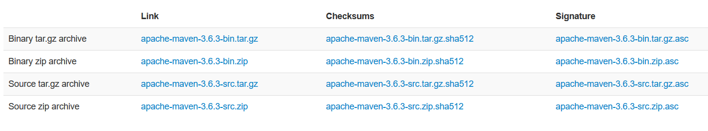
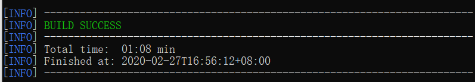

# maven下载及安装

## 一、下载

官网下载地址：[http://maven.apache.org/download.cgi](http://maven.apache.org/download.cgi) ;

进入页面后选择如下安装包：apach-maven-*.zip;



## 二、安装及配置

1. 解压文件

2. 配置环境变量：

   - 创建MAVEN_HOME环境变量，指向MAVEN的安装目录；
   - 将%MAVEN_HOME%\bin添加到PATH路径；

3. 验证安装：cmd中输入`mvn -version`；

4. 配置maven本地仓库：在maven解压文件中，conf目录中修改settings.xml文件；

   ```
     <!-- localRepository
      | The path to the local repository maven will use to store artifacts.
      |
      | Default: ${user.home}/.m2/repository
     <localRepository>/path/to/local/repo</localRepository>
     -->
   <localRepository>本地仓库的路径</localRepository>
   ```

5. 配置中央仓库的镜像，换成阿里的，在settings.xml文件中，在mirrors标签中添加子标签：

   ```
       <mirror>
         <id>nexus-aliyun</id>
         <mirrorOf>central</mirrorOf>
         <name>nexus-aliyun</name>
         <url>http://maven.aliyun.com/nexus/content/groups/public</url>
       </mirror>
   ```

   

## 检测

在命令行输入`mvn help:system`，输出一大堆下载后显示如下界面即成功：



