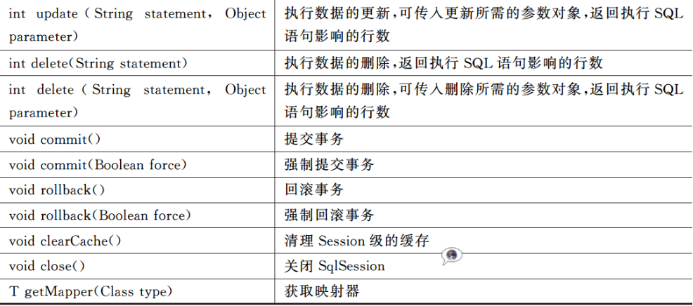

# MyBatis使用

## 一、概述

### JDBC的劣势

Jdbc是实现java程序实现数据访问的基础，提供了一套操作数据库的API，一般是通过加载驱动、获取连接、获取执行者对象、发送SQL语句等步骤实现数据库操作。

Jdbc的局限性：

- 代码繁琐
- 表结构维护复杂
- 硬编码
- 性能问题

### ORM

#### 概念

ORM的全称（Object Relational Mapping），即对象-关系映射。ORM是一种规范，将简单的Java对象（POJO）和数据库表记录进行映射，使数据库表中的记录和POJO一一对应。


#### ORM框架

hibernate和MyBatis

### Mybatis功能架构

MyBatis支持自定义SQL、存储过程以及高级映射，避免了几乎所有的JDBC代码和手动设置参数以及获取结果集，它使用XML文件或注解进行配置和映射，将接口和Java的POJO映射成数据库中的记录。

架构图：


### MyBatis工作流程


1. MyBatis读取配置文件和映射文件。其中，配置文件设置了数据源、事务等信息；映射文件设置了SQL执行相关的信息。映射文件要引入到配置文件中才能被执行。
2. MyBatis根据配置信息和映射信息生成SqlSessionFactory对象，SqlSessionFactory对象的重要功能是创建MyBatis的核心类对象SqlSession。
3. SqlSession中封装了操作数据库的所有方法，开发者一般调用SqlSession完成数据库操作。但是SqlSession并不直接操作数据库，而是通过更底层的Executor执行器接口操作数据库。Executor接口有两个实现类，一个是普通执行器，另一个是缓存执行器。
4. Exector执行器将要处理的SQL信息封装到一个MappedStatement对象中。在执行SQL语句之前，Executor执行器通过MappedStatement对象将输入的Java数据映射到SQL语句，在执行SQL语句之后，Executor执行器通过MappedStatement对象将SQL语句的执行结果映射为Java数据。其中，作为输入参数和输出结果的映射类型可以为Java基本类型，也可以为List、Map、POJO类型等。

### 重要API

#### SqlSessionFactory

##### 功能

创建SqlSession对象。

##### 说明

因此每个MyBatis应用程序都以SqlSessionFactory为基础。SqlSessionFactory存在于MyBatis应用的整个生命周期，重复创建SqlSessionFactory对象会造成数据库资源的过度消耗。因此一般使用单例模式创建SqlSessionFactory对象，即每一个数据库对应一个SqlSessionFactory对象。

##### 创建方式

SqlSessionFactory对象由SqlSessionFactoryBuilder对象创建，主要有以下两种形式：

```java
// 常用形式，inputStream封装了xml文件形式的配置信息，可选参数environment决定要加载的环境
// （包括数据源和事物管理器），可选参数props决定将要加载的properties文件。
SqlSessionFactory build(InputStream inputStream[,String environment][,properties props]);

// config需要预先定义
SqlSessionFactory build(Configuration config);
```

##### 创建SqlSession对象

通过openSession()方法创建SqlSession对象，具体形式：


#### SqlSession

##### 功能

SqlSession对象是MyBatis中的核心类对象，类似JDBC的Connection对象，用来执行持久化操作，具有强大的功能。

##### 注意事项

- SqlSession对象的声明周期贯穿数据库事务处理的过程，一定时间内未使用的SqlSession对象要及时关闭，以免影响系统性能；
- SqlSession对象是线程不安全的，也不能被共享；

##### 对象方法




### 下载使用

#### 官网地址

[https://github.com/mybatis/mybatis-3/releases](https://github.com/mybatis/mybatis-3/releases)


