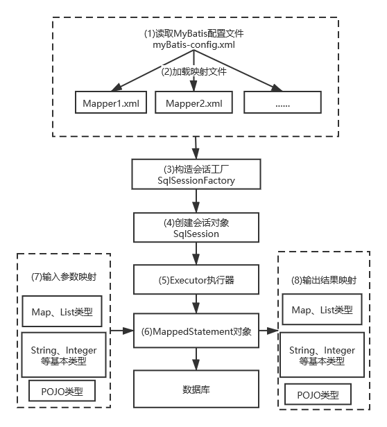

# Mybatis

## 简介

MyBatis是一个优秀的持久层框架，它对JDBC的操作数据库的过程进行封装。

### 工作原理

#### JDBC核心对象

- DriverManager：用于注册数据库连接；
- Connection：与数据库的连接对象；
- Statement/PrepareStatement：操作数据库的SQL对象；
- ResultSet：结果集或虚拟表。

#### JDBC工作模式

注：

[JDBC工作模式及示例](./jdbc连接数据库.md)

#### MyBatis核心对象

- SqlSession对象，该对象中包含了执行SQL语句的所有方法（类似于JDBC里面的Connection）；
- Executor接口，它将根据SqlSession传递的参数动态地生成需要执行的SQL语句，同时负责查询缓存的维护。类似于JDBC里面的Statement/PrepareStatement；
- MappedStatement对象，该对象是对映射SQL的封装，用于存储要映射的SQL语句的id、参数等信息；
- ResultHandler对象，用于对返回的结果进行处理，最终得到自己想要的数据格式或类型。可以自定义返回类型；

注：

- 在JDBC中，Connection不直接执行SQL方法，而是利用Statement或者PrepareStatement来执行方法。

  > 在使用JDBC建立了连接之后，可以使用Connection接口的createStatement()方法来获取Statement对象，也可以调用prepareStatement()方法获得PrepareStatement对象，通过executeUpdate()方法来执行SQL语句。

- SqlSession对象包含了执行SQL语句的所有方法。但是它是委托Executor执行的。

#### MyBatis工作流程



1. 读取MyBatis的配置文件。mybatis-config.xml为MyBatis的全局配置文件，用于配置数据库连接信息。
2. 加载映射文件。映射文件即SQL映射文件，该文件中配置了操作数据库的SQL语句，需要在MyBatis配置文件mybatis-config.xml中加载。mybatis-config.xml 文件可以加载多个映射文件，每个文件对应数据库中的一张表。
3. 构造会话工厂。通过MyBatis的环境配置信息构建会话工厂SqlSessionFactory。
4. 创建会话对象。由会话工厂创建SqlSession对象，该对象中包含了执行SQL语句的所有方法。
5. Executor执行器。MyBatis底层定义了一个Executor接口来操作数据库，它将根据SqlSession传递的参数动态地生成需要执行的SQL语句，同时负责查询缓存的维护。
6. MappedStatement对象。在Executor接口的执行方法中有一个MappedStatement类型的参数，该参数是对映射信息的封装，用于存储要映射的SQL语句的id、参数等信息
7. 输入参数映射。输入参数类型可以是Map、List等集合类型，也可以是基本数据类型和POJO类型。输入参数映射过程类似于JDBC对preparedStatement对象设置参数的过程。
8. 输出结果映射。输出结果类型可以是Map、List等集合类型，也可以是基本数据类型和POJO类型。输出结果映射过程类似于JDBC对结果集的解析过程。

### 代码示例

#### maven依赖

```java
	<dependencies>
        
        <!-- mysql-->
        <dependency>
            <groupId>mysql</groupId>
            <artifactId>mysql-connector-java</artifactId>
            <version>8.0.19</version>
        </dependency>
        
		<!-- mybatis-->
        <dependency>
            <groupId>org.mybatis</groupId>
            <artifactId>mybatis</artifactId>
            <version>3.4.6</version>
        </dependency>
        <!-- 日志-->
        <dependency>
            <groupId>log4j</groupId>
            <artifactId>log4j</artifactId>
            <version>1.2.17</version>
        </dependency>
        <!-- test -->
        <dependency>
            <groupId>junit</groupId>
            <artifactId>junit</artifactId>
            <version>4.12</version>
            <scope>compile</scope>
        </dependency>
    </dependencies>

```

#### config/db.properties

```java
// 数据库配置文件，我放在了resource的config目录下
jdbc.driver=com.mysql.cj.jdbc.Driver
jdbc.url=jdbc:mysql://localhost:3306/test
jdbc.username=root
jdbc.password=1234
```

#### myBatis-config.xml

```xml
<?xml version="1.0" encoding="UTF-8" ?>
<!DOCTYPE configuration
        PUBLIC "-//mybatis.org//DTD Config 3.0//EN"
        "http://mybatis.org/dtd/mybatis-3-config.dtd">

<configuration>
    <!-- 导入数据库连接配置文件 -->
    <properties resource="config/db.properties">
        <!--
			其他属性的配置，如jdbc.driver
			<property name="jdbc.drive" value="com.mysql.cj.jdbc.Driver"/>
		-->
    </properties>
    
    <!-- 和spring整合后 environments配置将废除-->
    <environments default="development">
        <environment id="development">
            <!-- 使用jdbc事务管理，事务控制由mybatis-->
            <transactionManager type="JDBC" />
            <!-- 数据库连接池,由mybatis管理-->
            <dataSource type="POOLED">
                <property name="driver" value="${jdbc.driver}" />
                <property name="url" value="${jdbc.url}" />
                <property name="username" value="${jdbc.username}" />
                <property name="password" value="${jdbc.password}" />
            </dataSource>
        </environment>
    </environments>
    
    <!-- Mapper映射文件加载 -->
    <mappers>
        <mapper resource="sqlmap/psd.xml"></mapper>
    </mappers>
</configuration>
```

#### sqlmap/psd.xml

```xml
<?xml version="1.0" encoding="UTF-8" ?>
<!DOCTYPE mapper
        PUBLIC "-//mybatis.org//DTD Mapper 3.0//EN"
        "http://mybatis.org/dtd/mybatis-3-mapper.dtd">


<!-- 
   namespace 命名空间，作用就是对sql进行分类化管理,理解为sql隔离
   注意：使用mapper代理方法开发，namespace有特殊重要的作用
 -->

<mapper namespace="test">
    
    <!-- 在映射文件中配置很多sql语句 -->
    <!--需求:通过id查询用户表的记录 -->
    <!-- 
     通过select执行数据库查询
     id:标识映射文件中的sql，称为statement的id
     将sql语句封装到mappedStatement对象中，所以将id称为statement的id
     parameterType:指定输入参数的类型
     #{}标示一个占位符,
     #{value}其中value表示接收输入参数的名称，如果输入参数是简单类型，那么#{}中的值可以任意。

     resultType：指定sql输出结果的映射的java对象类型，select指定resultType表示将单条记录映射成java对象
     -->
    <select id="findUserById" parameterType="int" resultType="top.songfang.mybatistest.Psd">
        SELECT * FROM  psd  WHERE id=#{id}
    </select>

    <!-- 
	根据用户名称模糊查询用户信息，可能返回多条
	resultType：指定就是单条记录所映射的java对象类型
	${}:表示拼接sql串，将接收到参数的内容不加任何修饰拼接在sql中。
	使用${}拼接sql，引起 sql注入
	${value}：接收输入参数的内容，如果传入类型是简单类型，${}中只能使用value
	 -->
    <select id="findUserByAccount" parameterType="java.lang.String" resultType="top.songfang.mybatistest.Psd">
        SELECT * FROM psd WHERE account LIKE '%${value}%'
    </select>

    <!--
    插入数据 parameterType：指定输入数据类型，参数类型为pojo
    #{}中指定pojo的属性名，接受到pojo对象的属性值，mybatis通过OGNL获取对象的属性值
    -->
    <insert id="insertId" parameterType="top.songfang.mybatistest.Psd">
        <!--
        将插入数据的主键返回，返回到user对象中

        SELECT LAST_INSERT_ID():得到刚insert进去记录的主键值，只适用于自增主键
        keyProperty:将查询到主键值设置到parameterType指定的对象的哪个属性
        order：SELECT LAST_INSERT_ID()执行顺序，相对于insert语句来说它的执行顺序
        resultType：指定SELECT LAST_INSERT_ID()的结果类型
        -->
        <selectKey keyProperty="id" order="AFTER" resultType="int">
            SELECT LAST_INSERT_ID()
        </selectKey>
        INSERT INTO psd (account,password,tip) values (#{account},#{password},#{tips})
        <!--
        使用mysql的uuid（）生成主键
        执行过程：
        首先通过uuid()得到主键，将主键设置到user对象的id属性中
        其次在insert执行时，从user对象中取出id属性值
         -->
    <!--  
		<selectKey keyProperty="id" order="BEFORE" resultType="java.lang.String">
        	SELECT uuid()
    	</selectKey>
    	insert into psd(id,account,password,tip) value(#{account},#{password},#	{tips}) 
	-->
    </insert>

    <!-- 根据id进行删除 -->
    <delete id="deletePsd" parameterType="java.lang.Integer">
        delete from psd where id=#{id}
    </delete>

    <!-- 更新 -->
    <update id="updatePsd" parameterType="top.songfang.mybatistest.Psd">
        update psd set id=#{id},account=#{account},password=#{password},tip=#{tips} where id=#{id}
    </update>
</mapper>
```

#### POJO

```java
package top.songfang.mybatistest;

public class Psd {
    private int id;
    private String account;
    private String password;
    private String tips;

    public Psd() {
    }

    public Psd( String account, String password, String tips) {
        this.account = account;
        this.password = password;
        this.tips = tips;
    }

    @Override
    public String toString() {
        return "Psd{" +
                "id=" + id +
                ", account='" + account + '\'' +
                ", password='" + password + '\'' +
                ", tips='" + tips + '\'' +
                '}';
    }
    -------setter/getter-----------------
}

```

#### 数据库

连接mysql数据库：有可能出现时区问题，解决办法：

[MySQL连接时时区问题](./MySql连接出现时区问题.md)

数据库设计(test.psd)：

|    id    |   int   |
| :------: | :-----: |
| account  | varchar |
| password | varchar |
|   tip    | varchar |

#### test类

```java
package top.songfang.mybatistest;

import org.apache.ibatis.io.Resources;
import org.apache.ibatis.session.SqlSession;
import org.apache.ibatis.session.SqlSessionFactory;
import org.apache.ibatis.session.SqlSessionFactoryBuilder;

import java.io.IOException;
import java.io.InputStream;
import java.util.List;

import org.junit.Test;

public class MybatisTest {
    @Test
    public void select0() throws IOException {
        // MyBatis配置路径
        String resource="myBatis-config.xml";
        // 输入流
        InputStream inputStream= Resources.
                getResourceAsStream(resource);
        // 创建sqlSessionFactory
        SqlSessionFactory sqlSessionFactory=new
                SqlSessionFactoryBuilder().build(inputStream);
        // 创建Session
        SqlSession sqlSession=sqlSessionFactory.openSession();

        Psd psd=sqlSession.selectOne("test.findUserById",1);
        System.out.println(psd);
        sqlSession.close();
    }
    @Test
    public void select() throws IOException {
        String resource1="myBatis-config.xml";
        InputStream inputStream1= Resources.
                getResourceAsStream(resource1);
        SqlSessionFactory sqlSessionFactory1=new
                SqlSessionFactoryBuilder().build(inputStream1);
        SqlSession sqlSession1=sqlSessionFactory1.openSession();
        List<Psd> list=sqlSession1.selectList("test.findUserByAccount","FDSAF4");
        System.out.println(list);
        sqlSession1.close();
    }
    @Test
    public void insert() throws IOException {
        String resource="myBatis-config.xml";
        InputStream inputStream= Resources.
                getResourceAsStream(resource);
        SqlSessionFactory sqlSessionFactory=new
                SqlSessionFactoryBuilder().build(inputStream);
        SqlSession sqlSession=sqlSessionFactory.openSession();

        Psd psd=new Psd("taoasdsa","1asdaasdP","daao");
        sqlSession.insert("test.insertId",psd);
        sqlSession.commit();
        System.out.println(psd.getId());
        sqlSession.close();
    }
    @Test
    public void delete() throws IOException {
        String resource="myBatis-config.xml";
        InputStream inputStream= Resources.
                getResourceAsStream(resource);
        SqlSessionFactory sqlSessionFactory=new
                SqlSessionFactoryBuilder().build(inputStream);
        SqlSession sqlSession=sqlSessionFactory.openSession();

        sqlSession.delete("test.deletePsd",6);
        sqlSession.commit();
        sqlSession.close();
    }
    @Test
    public void update() throws IOException {
        String resource="myBatis-config.xml";
        InputStream inputStream= Resources.
                getResourceAsStream(resource);
        SqlSessionFactory sqlSessionFactory=new
                SqlSessionFactoryBuilder().build(inputStream);
        SqlSession sqlSession=sqlSessionFactory.openSession();

        Psd psd=new Psd("agiukjks","1acsadP","aas");
        psd.setId(7);
        sqlSession.update("test.updatePsd",psd);
        sqlSession.commit();
        sqlSession.close();
    }
}

```

### SqlSession

SqlSession是MyBatis的关键对象，通过这个接口可以操作命令，管理事务等。

**需要注意的是**：虽然SqlSession提供select/insert/update/delete方法，在旧版本中使用使用SqlSession接口的这些方法，但是新版的Mybatis中就会建议使用Mapper接口的方法。

#### 旧版本

`Person p = session.selectOne("cn.mybatis.mydemo.mapper.PersonMapper.selectPersonById", 1);`

#### 新版本

```java
    // 获得mapper接口的代理对象
    PersonMapper pm = session.getMapper(PersonMapper.class);
    // 直接调用接口的方法，查询id为1的Peson数据
    Person p = pm.selectPersonById(1);
```

#### 线程安全

SqlSession是应用程序与持久存储层之间执行交互操作的一个单线程对象，也是MyBatis执行持久化操作的关键对象。

SqlSession对象完全包含以数据库为背景的所有执行SQL操作的方法，它的底层封装了JDBC连接，可以用SqlSession实例来直接执行已映射的SQL语句。

SqlSession 的实例不是线程安全的，因此是不能被共享的，所以它的最佳的作用域是**请求或方法作用域**。**绝对不能**将 SqlSession  实例的引用放在一个类的静态域，甚至一个类的实例变量也不行。也不能将 SqlSession 实例的引用放在任何类型的托管作用域中，比如  Servlet 框架中的 HttpSession。如果你现在正在使用一种 Web 框架，要考虑 SqlSession 放在一个和 HTTP  请求对象相似的作用域中。换句话说，每次收到的 HTTP 请求，就可以打开一个  SqlSession，返回一个响应，就关闭它。这个关闭操作是很重要的，你应该把这个关闭操作放到 finally 块中以确保每次都能执行关闭。

可以可以考虑使用**ThreadLocal**来封装SqlSession。

#### 常用方法

1. `int insert(String statement)`：插入方法，参数statement是在配置文件中定义的<insert.../>元素的id，返回执行SQL语句所影响的行数。
2. `int insert(String statement，Object  parameter)`：插入方法，参数statement是在配置文件中定义的<insert.../>元素的id，parameter是插入所需的参数，通常是对象或者Map，返回执行SQL语句所影响的行数。
3. `int update(String statement)`：更新方法，参数statement是在配置文件中定义的<update.../>元素的id，返回执行SQL语句所影响的行数。
4. `int update(String statement，Object  parameter)`：更新方法，参数statement是在配置文件中定义的<update.../>元素的id，parameter是插入所需的参数，通常是对象或者Map，返回执行SQL语句所影响的行数。
5. `int delete(String statement)` ：删除方法，参数statement是在配置文件中定义的<delete.../>元素的id。返回执行SQL语句所影响的行数。
6. `int delete(String statement，Object parameter)`：删除方法，参数statement  是在配置文件中定义的<delete.../>元素的id，parameter是插入所需的参数，通常是对象或者Map，返回执行SQL语句所影响的行数。
7. `<T> T selectOne(String slatement)`:查询方法，参数statement是在配置文件中定义的<select.../>元素的id，返回执行SQL语句查询结果的泛型对象，通常查询结果只有一条数据时才使用。
8. `<T> T selectOne(String statement，Object  parameter)`：查询方法，参数statement是在配置文件中定义的<select.../>元素的id，parameter是查询所需的参数，通常是对象或者Map，返回执行SQL语句查询结果的泛型对象，通常查询结具只有一条数据时才使用。
9. `<E> List<E> selectList(String statemenl)`：查询方法，参数是在配置文件中定义的<select.../>素的id，返回执行SQL话句查询结果的泛型对象的集合。
10. `<E>  List<E> selectList(String statement，Object  parameter)`：查询方法，参数statement是在配置文件中定义的<select../>元素的id，parameter是查询所需的参数，通常是对象或者Map，返回执行SQL语句查询结果的泛型对象的集合。
11. `<E>  List<E> selectList(String statement，Object parameter，RowBounds  rowBounds)`：查询方法，参数statement是在配置文件中定义的<select.../>元素的id，parameter是查询所需的参数，通常是对象或者Map，RowBounds对象用于分页，它的两个属性:  offset指查询的当前页数; limit指当前页显示多少条数据。返回执行SQL语句查询结果的泛型对象的集合。
12. `<K，V>  Map<K，V> selectMap(String statement，String mapKey)` ：查询方法，参数statement是在配置文件中定义的<select.../>元素的id，mapKey是返回数据的其中一个列名，执行SQL语句查询结果将会被封装成一个Map集合返回，key就是参数mapKey传入的列名，value是封装的对象。
13. `<K，V>  Map<K，V> selectMap(String statement，0bject parameler，Sting  mapKey)`：查询方法，参数statement是在配置文件中定义的<select.../>元素的id，parameter是查询所需的参数，通常是对象或者Map，mapKey  是返回数据的其中一个列名，执行SQL语句查询结果将会被封装成一个Map集合返回，key就是参数mapKey传入的列名，value是封装的对象。
14. `<K，V>  Map<K，V>selectMap(Sting statement，Object parameter，Sting  mapKey，RowBounds rowBounds)`：查询方法，参数statement  是在配置文件中定义的<select.../>元素的id，parameter 是否询所需的参数，通常是对象或者Map，mapKey  是返回数据的其中一个列名，RowBounds 对象用于分页。执行SQL  语句查询结果将会被封装成一个Map集合返回，key就是参数mapKey传入的列名，value是封装的对象。
15. `void  select(String statement，ResultHandler  handler)`：查询方法，参数statement是在配置文件中定义的<select../>元素的id，ResultHandler对象用来处理查询返回的复杂结果集，通常用于多表查询。
16. `void  select(String statement，Object parameter，ResultHander  handler)`：查询方法，参数statement是在配置文件中定义的<select../>元素的id，parameter  是查询所需的参数，通常是对象或者Map， ResultHandler对象用来处理查询返回的复杂结果集，通常用于多表查询。
17. `void  select(String statement，Object parameter，RowBounds  rowBounds，ResultHandr  handler)`：查询方法，参数statement是在配置文件中定义的<select.../>元素的id，是查询所需的参数，通常是对象或者Map，RowBounds  对象用于分页，ResultHandr对象用来处理查询返回的复杂结果集，通常用于多表查询。
18. `void commit()`：提交事务。
19. `void rollback()`：回滚事务。
20. `void close()`：关闭SqlSession对象。
21. `Connection getConnection()`：获得JDBC的数据库连接对象。
22. `<T>  T getMapper(Class<T>  type)`：返回mapper接口的代理对象，该对象关联了SqlSession对象，开发者可以通过该对象直接调用方法操作数据库，参数type是Mapper的接口类型。Mybatis官方手册建议通过mapper对象访问MyBatis。

#### SqlSession与Executor

SqlSession只是一个前台客服，真正发挥作用的是Executor，对SqlSession方法的访问最终都会落到Executor的相应方法上去。Executor分成两大类：一类是CachingExecutor，另一类是普通的Executor。

- CachingExecutor有一个重要属性delegate，它保存的是某类普通的Executor，在构造函数时候传入。执行数据库update操作时，它直接调用delegate的update方法，执行query方法时先尝试从cache中取值，取不到再调用delegate的查询方法，并将查询结果存入cache中。
- 普通Executor分三类：SimpleExecutor、ReuseExecutor和BatchExecutor。它们都继承于BaseExecutor，BatchExecutor专门用于执行批量sql操作，ReuseExecutor会重用Statement执行sql操作，SimpleExecutor只是简单执行sql。
  - SimpleExecutor是一种常规执行器，每次执行都会创建一个Statement，用完后关闭。
  - ReuseExecutor是可重用执行器，将Statement存入map中，操作map中的Statement而不会重复创建Statement。
  - BatchExecutor是批处理型执行器，doUpdate预处理存储过程或批处理操作，doQuery提交并执行过程。

总之，Executor最终是通过JDBC的java.sql.Statement来执行数据库操作。

### MyBatis映射器

MyBatis框架包括两种类型的XML文件，一类是配置文件，即mybatis-config.xml，另外一类是映射文件，例如XXXMapper.xml等。在MyBatis的配置文件mybatis-config.xml包含了`<mappers></mappers>`节点，这里就是MyBatis映射器。

#### 历史

- MyBatis 3之前，只支持XML映射器，即所有的SQL语句必须在XML中配置；
- MyBatis 3.1之后，开始支持接口映射器，其底层利用的是接口绑定技术；同时接口映射器支持通过注解定义SQL语句，用来代替XML文件配置SQL。

#### 分类

1. 纯xml映射器,利用SqlSession的各种方法实现增删改查;
2. xml映射器+接口映射器的混合类型: 先定义接口映射器，然后在定义xml映射器, 其中xml映射器的namespace应该对应接口映射器的类名.
3. 注解+接口映射器的混合模式:此类形式，将原先xml里面的sql配置信息，变成Java注解的形式写到接口映射器.

#### 引入映射器的三种方式

1. 通过文件路径引入映射器接口

   ```java
   <mappers>
       <mapper resource="StudentMapper.xml"/>
   </mappers>
   ```

2. 通过包名引入映射器接口

   ```java
   <mappers>
       <package name="top.songfang.demo.mapper"/>
   </mappers>
   ```

3. 用类注册引入映射器接口

   ```java
   <mappers>
       <package class="top.songfang.demo.mapper.StudentMapper"/>
   </mappers>
   ```

#### 示例

##### 准备

User类:

```java
package top.songfang.mybatistest;

public class User {
    private int id;
    private String name;
    private String address;

    public User() {
    }

    public User( String name, String address) {
        this.name = name;
        this.address = address;
    }

    @Override
    public String toString() {
        return "User{" +
                "id=" + id +
                ", name='" + name + '\'' +
                ", address='" + address + '\'' +
                '}';
    }
    ------setter/getter----------
}
```

数据库:

```sql
    CREATE TABLE `user` (
        `id` int(4) NOT NULL,
        `name` varchar(20) DEFAULT NULL,
        `address` varchar(20) DEFAULT NULL,
        PRIMARY KEY (`id`)
    ) ENGINE=InnoDB DEFAULT CHARSET=utf8;
```

##### xml映射器+接口映射器

接口定义:

```java
package top.songfang.mybatistest;

public interface UserMapper {
    // 通过id查询数据
    public User getUser(int id);
}
```

> 注意：映射器只是一个接口，而不是一个实现类。初学者可能会产生一个很大的疑问：接口不是不能运行吗？的确，接口不能直接运行，但是MyBatis内部运用了动态代理技术，生成接口的实现类，从而完成接口的相关功能。只要明白 MyBatis 会为这个接口生成一个代理对象，代理对象会去处理映射器接口相关的逻辑即可。

xml方式创建映射器UserMapper.xml:

```xml
<?xml version="1.0" encoding="UTF-8"?>
<!DOCTYPE mapper PUBLIC "-//mybatis.org//DTD Mapper 3.0//EN"
    "http://mybatis.org/dtd/mybatis-3-mapper.dtd">

<mapper namespace="top.songfang.mybatistest.UserMapper">
    <!--
	注意事项:
		1. id值为UserMapper接口中的方法名,一一对应;
		2. namespace以及resultType均为类全路径;
		3. Mapper接口方法的输出参数类型和mapper.xml中定义的每个sql的resultType的类型相同；
		4. Mapper接口方法的输入参数类型和mapper.xml中定义的每个sql的parameterType的类型相同；
	-->
    <select id="getUser" parameterType="int" 
            resultType="top.songfang.mybatistest.User">
        SELECT id,name,address FROM Student WHERE id =#{id}
    </select>
</mapper>
```

mybatis-user.xml中配置mapper:

```java
    <mappers>
        <mapper resource="UserMapper.xml"></mapper>
    </mappers>
```

Test测试:

```java
    @Test
    public void userSelect() throws IOException {
        String resource="SqlMapConfig.xml";
        InputStream inputStream=Resources.getResourceAsStream(resource);
        SqlSessionFactory sqlSessionFactory=
                new SqlSessionFactoryBuilder().build(inputStream);
        SqlSession sqlSession=sqlSessionFactory.openSession();

        // 接口绑定
        UserMapper  um=sqlSession.
                getMapper(UserMapper.class);
        // 方法调用
        User user=um.getUser(1);
        System.out.println(user);
        sqlSession.close();
    }
```

##### Java注解+接口映射器

Java注解:等同于xml方式创建映射器,比使用xml方式简单,当注解方式和xml方式同时使用时,xml方式将覆盖掉注解方式.

```java
package top.songfang.mybatistest;

import org.apache.ibatis.annotations.Insert;

public interface UserMapper {
    @Insert("insert into user (name,address) values(#{name},#{address})")
    public int setUser(User user);
}

// 该接口可以在xml中进行定义----非必要
// 不定义就可以正常使用
<mappers>
    <mapper class="top.songfang.mybatistest.UserMapper"/>
</mappers>
```

test:

```java
    @Test
    public void userSelect() throws IOException {
        String resource="SqlMapConfig.xml";
        InputStream inputStream=Resources.getResourceAsStream(resource);
        SqlSessionFactory sqlSessionFactory=
                new SqlSessionFactoryBuilder().build(inputStream);
        SqlSession sqlSession=sqlSessionFactory.openSession();

        UserMapper  um=sqlSession.
                getMapper(UserMapper.class);
        User user=new User("xiaosan","shanghai");
        int i=um.setUser(user);
        // 提交数据
        sqlSession.commit();
        System.out.println(i);
        sqlSession.close();
    }
```

#### 映射器的使用

两种方式:

- 获得xml映射文件中定义的操作语句;

  `sqlsession.select("top.songfang.mybatistest.UserMapper.getUser",1);`

- 获得mapper接口的代理对象;

  `session.getMapper(StudentMapper.class);`

#### mybatis接口绑定

接口绑定，就是在MyBatis中任意定义接口，然后把接口里面的方法和SQL语句绑定，我们直接调用接口方法就可以，这样比起原来了SqlSession提供的方法，可以有更加灵活的选择和设置。

接口绑定有两种实现方式:

- 一种是通过注解绑定，就是在接口的方法上面加上 @Select、@Update等注解，里面包含Sql语句来绑定；
- 另外一种就是通过xml里面写SQL来绑定，在这种情况下，要指定xml映射文件里面的namespace必须为接口的全路径名。

Sql语句比较简单时候，用注解绑定，当SQL语句比较复杂时候，用xml绑定。一般情况下，用xml绑定的比较多.

注意事项:

- Mapper接口方法名和mapper.xml中定义的每个sql的id相同；
- Mapper接口方法的输入参数类型和mapper.xml中定义的每个sql 的parameterType的类型相同；
- Mapper接口方法的输出参数类型和mapper.xml中定义的每个sql的resultType的类型相同；
- Mapper.xml文件中的namespace即是mapper接口的类路径。


